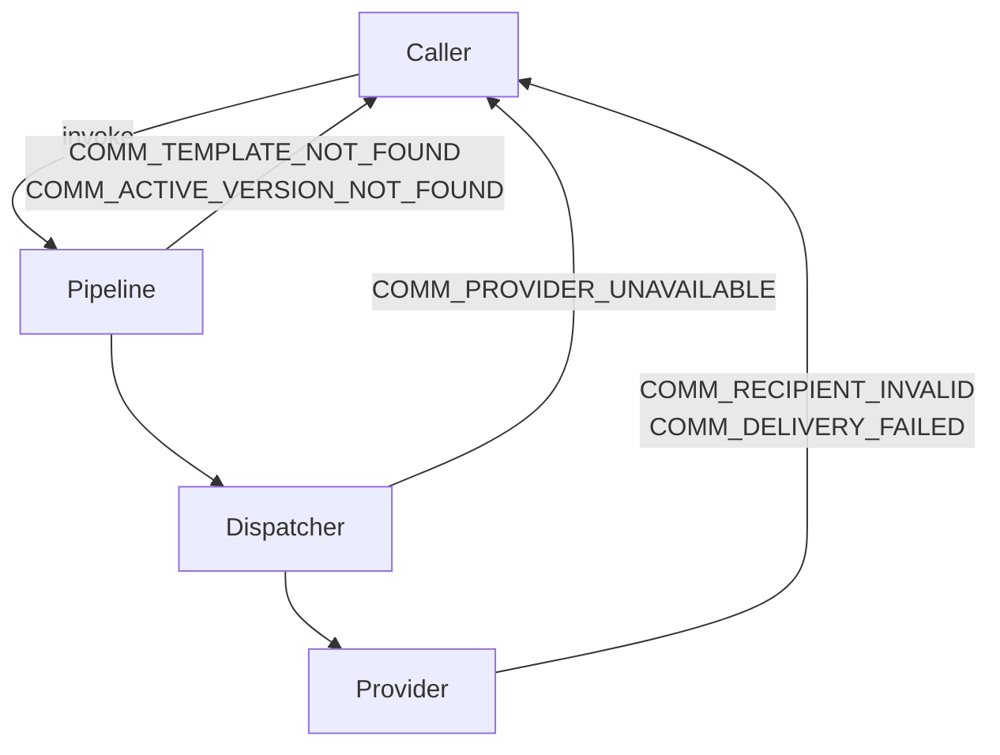

# Architecture Diagrams

## Full template-to-delivery flow

```mermaid
flowchart LR
  T[Template] --> V[Version]
  V --> R[Renderer]
  R --> P[Pipeline]
  P --> D[Dispatcher]
  D --> Pr[Provider]
  Pr --> Del[Delivery]
```

## Campaign delivery flow

```mermaid
flowchart LR
  C[Campaign] --> P[Pipeline]
  P --> D[Dispatcher]
  D --> E[Email Provider]
  E --> Re[Resend]
```

## Error propagation

```mermaid
flowchart TD
  A[Caller] -->|invoke| P[Pipeline]
  P -->|COMM_TEMPLATE_NOT_FOUND<br/>COMM_ACTIVE_VERSION_NOT_FOUND| A
  P --> D[Dispatcher]
  D -->|COMM_PROVIDER_UNAVAILABLE| A
  D --> Pr[Provider]
  Pr -->|COMM_RECIPIENT_INVALID<br/>COMM_DELIVERY_FAILED| A
```
